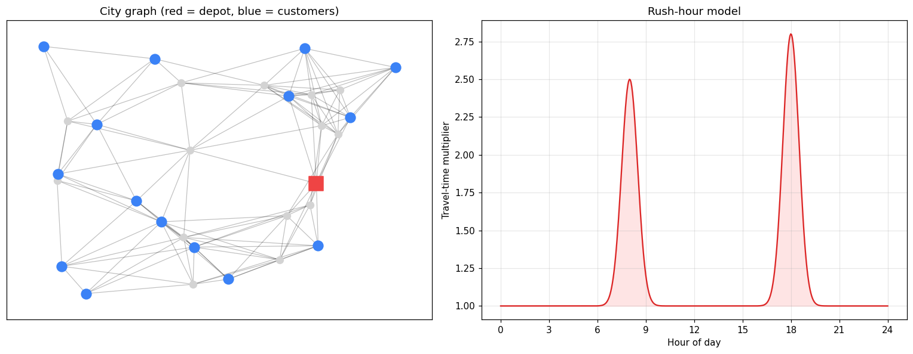
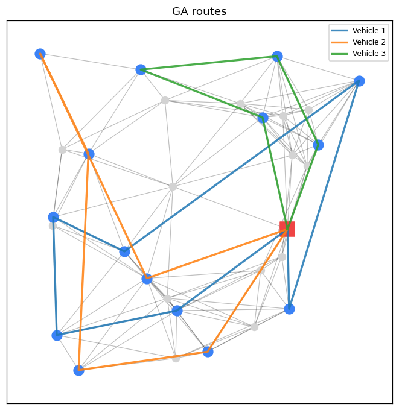
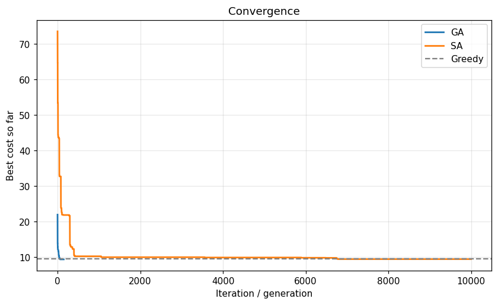
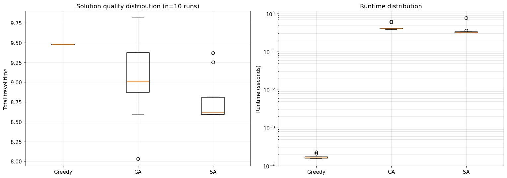
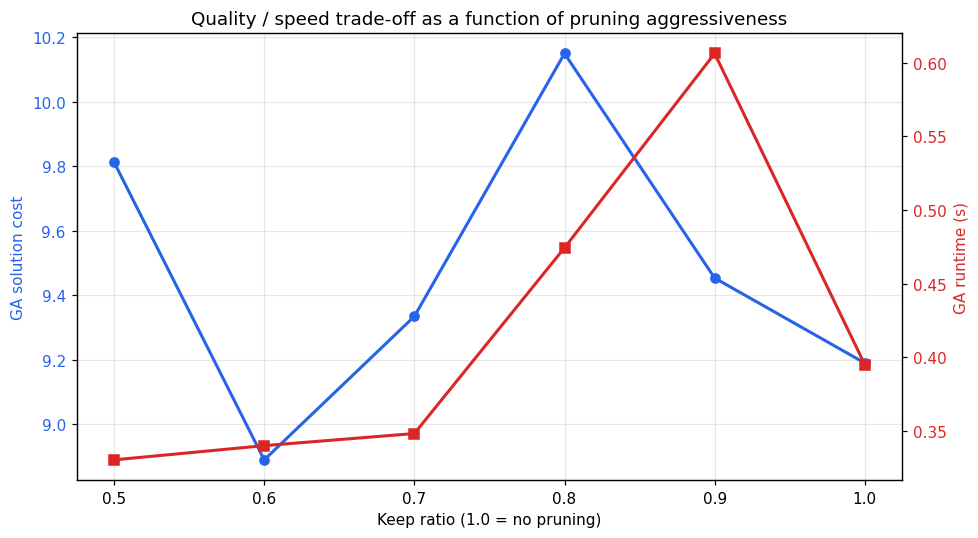

# Time-Dependent Vehicle Routing with Heuristic Optimization

Solving the Vehicle Routing Problem with Time Windows (VRPTW) on a city whose travel times change with rush-hour traffic — comparing a greedy baseline, a Genetic Algorithm, Simulated Annealing, and an ML-based graph-pruning approach.

## The problem

A delivery company has a fleet of vehicles that must visit a set of customers from a central depot. Each customer has a **demand** (how much cargo they ordered), a **delivery time window**, and sits somewhere on a city road network. Each vehicle has a **capacity limit**. Travel times depend on **departure hour** — driving through the city at 8 AM is slower than at 2 PM.

The goal: find routes that minimize total travel time while respecting capacity and time-window constraints.

This is NP-hard. For 15 customers with 4 vehicles, there are more possible routings than atoms in a kilogram of iron. Exact solvers don't scale, so we use heuristics.

## Approach

| Method | What it does | Purpose |
|---|---|---|
| **Greedy** | Nearest-feasible-insertion | Baseline |
| **Genetic Algorithm** | Evolutionary search with OX crossover and 3-operator mutation | Population-based heuristic |
| **Simulated Annealing** | Single-solution search with geometric cooling | Trajectory-based heuristic |
| **ML Edge Pruner** | PyTorch MLP that predicts useful edges and removes the rest before optimization | Speed up optimization via learned preprocessing |

All four share an identical time-dependent route evaluator, so comparisons are fair.

## Example output

Each color is one vehicle's route. The red square is the depot; blue circles are customers.

## Results

### Baseline comparison (single run, 30-node city, 15 customers)

Greedy produces a valid solution in under a millisecond. GA and SA both converge to lower costs within about half a second.

### Statistical comparison (10 independent runs)

| Method | Mean cost | Std | Mean runtime |
|---|---|---|---|
| Greedy | 9.477 | 0.000 | <1 ms |
| GA | 9.067 | 0.507 | 441 ms |
| SA | **8.784** | 0.277 | 368 ms |

**Welch's t-tests:**
- GA vs Greedy: t = −2.424 (significant improvement)
- SA vs Greedy: t = −7.492 (highly significant improvement)
- SA vs GA: t = −1.466 (directionally favors SA)

SA wins on three axes simultaneously: lowest mean cost, lowest variance, fastest runtime.

### ML edge pruning sensitivity

A surprising finding: moderate pruning (`keep_ratio = 0.6`, removing 40% of edges) produces **lower** GA cost than the unpruned graph (8.890 vs 9.190). The reduced search space appears to act as an implicit regularizer, helping the GA converge within its fixed generation budget. This non-monotonic behavior warrants multi-seed validation as follow-up work.

### Scaling study

On larger problems (n = 100 nodes, 50 customers), GA with fixed hyperparameters **underperforms greedy** (31.46 vs 28.98), while SA continues to dominate (25.61). Take-away: GA's population size and generation count must scale with problem size; SA is more forgiving.

The notebook is organized into the following sections:

1. Setup and imports
2. City simulator (random geometric graph + Gaussian rush-hour model)
3. VRP problem definition (customers, demands, time windows, fleet)
4. Route evaluator + greedy baseline
5. Genetic Algorithm (permutation encoding, OX crossover, multi-operator mutation)
6. Simulated Annealing (geometric cooling)
7. ML edge pruner (PyTorch MLP on 7-dimensional edge features)
8. Plotting helpers
9. Experiments: single-run comparison, multi-run statistical test, scaling study, pruning sweep
10. Conclusions

Every experiment runs top-to-bottom with no hidden state — rerun any cell to verify.

## Key design choices

- **Permutation encoding** shared between GA and SA means the same mutation operators work in both algorithms; comparisons isolate the search strategy, not the representation.
- **Time-dependent travel** uses base shortest-path distances multiplied by a departure-time factor, rather than fully FIFO time-dependent Dijkstra. This is a standard VRP research approximation — orders of magnitude faster to evaluate, and accurate enough for this problem size.
- **Connectivity-preserving pruning** — the ML pruner removes edges one at a time and skips any removal that would disconnect the graph, preventing infeasibility.
- **GNN-lite features** — the edge MLP uses hand-crafted features including local node degrees and distances to the city centroid, which inject graph-structural information without requiring a full message-passing GNN. A drop-in upgrade to `torch_geometric.nn.GCNConv` is straightforward.

## Limitations

- Random geometric graphs differ from real road networks in degree distribution and topology.
- Travel-time model approximates FIFO time-dependency via departure-time multipliers.
- GA hyperparameters are fixed, not tuned per problem size.
- Pruning sweep uses a single seed per `keep_ratio`; multi-seed validation is future work.
- The ML model is an MLP on hand-engineered features, not a true graph neural network.

## Future work

- Multi-seed pruning sweep to validate the non-monotonic finding
- Full GNN via PyTorch Geometric (`GCNConv`) with learned edge embeddings
- Adaptive GA hyperparameters that scale with problem size
- Benchmark on standard Solomon and Homberger VRPTW instances
- Multi-depot extension; heterogeneous fleet
- Stochastic demands and online customer arrivals for a real-time delivery setting
